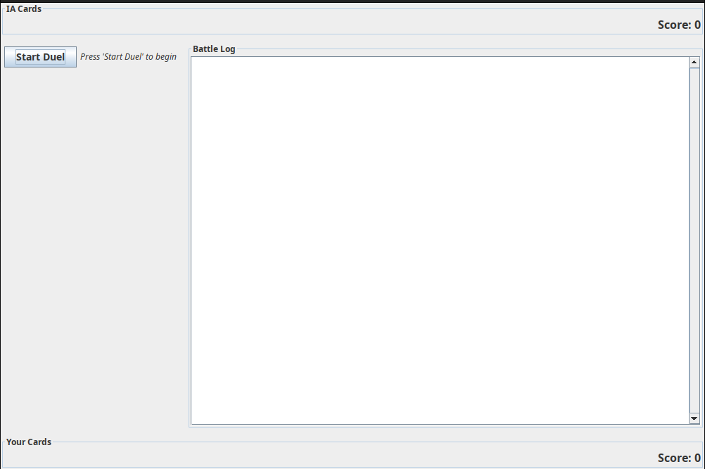
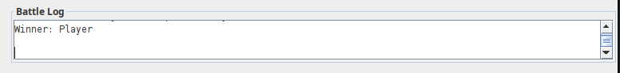

# 🃏 Yu-Gi-Oh! Duel Lite

Mini-aplicación de escritorio en **Java Swing** que simula un duelo sencillo de Yu-Gi-Oh! entre un jugador y la máquina 🤖.  
El juego utiliza datos obtenidos en vivo desde la **API [YGOProDeck](https://db.ygoprodeck.com/api-guide/)** para generar cartas aleatorias y enfrenta a ambos jugadores en un duelo de 3 rondas.

---

## 📌 Características principales

- 🔸 Consumo de API REST en tiempo real para obtener cartas Monster aleatorias.
- 🧠 Lógica de duelo simplificada: el primero en ganar 2 rondas es el vencedor.
- 🃏 Visualización de cartas con imagen, nombre, ATK y DEF.
- 📝 Registro de batalla desplazable que muestra jugadas y puntajes.
- 🖥️ Interfaz gráfica construida completamente con **Java Swing**.
- ⚡ Comunicación entre lógica y GUI mediante listeners (`BattleListener`).

---

## 🧱 Estructura del proyecto

```
YuGiOhDuelLite/
│
├─ src/
│  └─ com/yugiohduel/
│     ├─ api/
│     │  └─ YgoApiClient.java       # Cliente para consumir API YGOProDeck
│     │
│     ├─ game/
│     │  ├─ BattleListener.java     # Interface para eventos del duelo
│     │  └─ Duel.java               # Lógica central del juego
│     │
│     ├─ model/
│     │  └─ Card.java               # Modelo de datos de una carta
│     │
│     └─ ui/
│        └─ DuelUI.java            # Interfaz gráfica principal (Swing)
│
├─ pom.xml                         # Configuración Maven + dependencias
├─ .gitignore
└─ YuGiOhDuelLite.iml
```

---

## 🚀 Instrucciones de ejecución

### ✅ Requisitos previos
- ☕ **Java 11** o superior
- 🧰 Maven instalado (o usar IntelliJ IDEA directamente)
- 🌐 Conexión a Internet (para consumir la API)

### ▶️ Ejecutar con IntelliJ IDEA
1. Clona este repositorio:
   ```bash
   git clone https://github.com/tu-usuario/YuGiOhDuelLite.git
   cd YuGiOhDuelLite
   ```
2. Abre el proyecto en **IntelliJ IDEA**.
3. Espera a que Maven descargue las dependencias.
4. Ejecuta la clase:
   ```
   com.yugiohduel.ui.DuelUI
   ```
5. Presiona **“Start Duel”** y ¡a jugar! 🎮

### ▶️ Ejecutar desde terminal (Maven)
```bash
mvn clean compile exec:java -Dexec.mainClass="com.yugiohduel.ui.DuelUI"
```

---

## 🧠 Diseño y lógica

El diseño sigue el principio **MVC (Modelo–Vista–Controlador)**:

- **Modelo:** `Card` representa los datos de una carta obtenida desde la API.
- **Controlador:** `Duel` gestiona toda la lógica del enfrentamiento.
- **Vista:** `DuelUI` muestra las cartas, log de batalla y botones de interacción.

Los eventos entre la lógica y la interfaz se comunican mediante la interfaz `BattleListener`, que notifica:
- `onTurn(playerCard, aiCard, winner)`
- `onScoreChanged(playerScore, aiScore)`
- `onDuelEnded(winner)`

---

## 📝 Reglas del duelo

1. Cada jugador recibe **3 cartas Monster** aleatorias desde la API.
2. Se muestra su imagen, nombre, ATK y DEF.
3. Por turnos:
    - 🧍 El jugador elige una carta.
    - 🤖 La IA elige una carta al azar.
    - Se comparan ATK vs ATK → gana el mayor.
4. El ganador del turno obtiene 1 punto.
5. El primero en ganar **2 rondas** es el vencedor 🏆.

---

## 🛠️ Tecnologías utilizadas

- **Java 11+**
- **Swing** para la GUI
- **java.net.http.HttpClient** para consumir la API REST
- **org.json** para parsear JSON
- **Maven** como gestor de dependencias

---

## 📸 Capturas de pantalla




---

## 👨‍💻 Autor

**César Peñaranda**  
📅 Laboratorio 1 - Desarrollo de Software III  
🧑‍🏫 Docente: Mg(c). Juan Pablo Pinillos Reina  
🏫 Universidad del Valle

---


